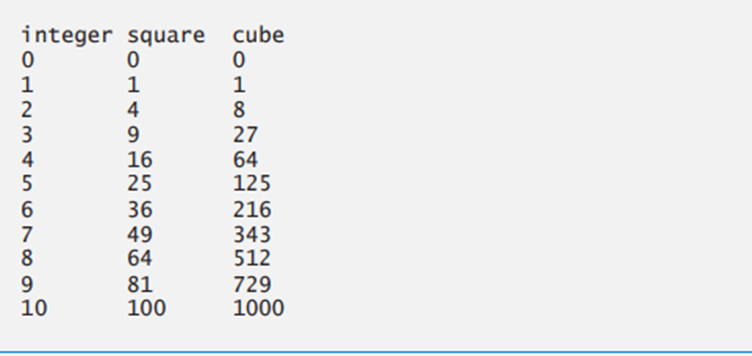
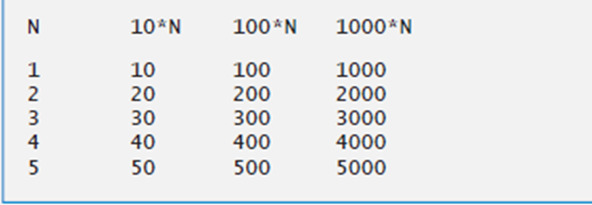
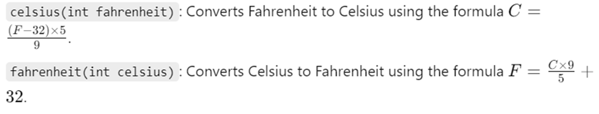

# OOP Lab Assignments

This repository contains **basic C++ and Object-Oriented Programming (OOP) lab assignments**, covering fundamental concepts such as **classes, inheritance, polymorphism, and encapsulation**.

---

## Lab 01

1. **Print a Welcome Message**
   - Print: `Welcome to IUT`

2. **Variable Declaration and Printing**
   - Declare variables of different types (`int`, `float`, `double`, `char`) and print their values.

3. **Calculate Area of Square**
   - Input the side of a square from the user and calculate its area.

---

## Lab 02

1. **Operations on Three Integers**
   - Input three integers from the keyboard.
   - Calculate and print:
     - Sum
     - Average
     - Product
     - Smallest and largest number  
   *(Do not use built-in `min` or `max` functions.)*

2. **Squares and Cubes Table**
   - Print a table of squares and cubes of integers from 0 to 10 using tabs.
   - *(Without using a for loop)*  

   

3. **Daily Driving Cost Calculator**
   - Input:
     - Total km driven per day
     - Cost per liter of gasoline
     - Average km per liter
   - Calculate and display **total cost per day**:  
     ```
     Total cost per day = (total km / average km per liter) * cost per liter
     ```

---

## Lab 03

1. **Income Tax Calculator**
   - Tax rules:
     - Salary < 2000 → 0% tax
     - 2001 ≤ Salary < 3000 → 20% tax
     - 3001 ≤ Salary < 5000 → 30% tax
     - Salary > 5000 → 40% tax
   - Display:
     - Tax payable
     - Income after tax deduction

2. **Odd, Even, or Zero Checker**
   - Input a number and print whether it is **odd**, **even**, or **zero**.

3. **Steel Grade Calculator**
   - Input:
     - Hardness
     - Carbon content
     - Tensile strength
   - Grading rules:
     ```
     All conditions satisfied → Grade 10
     a & b satisfied → Grade 9
     b & c satisfied → Grade 8
     a & c satisfied → Grade 7
     Any one condition satisfied → Grade 6
     None satisfied → Grade 5
     ```
   - Print the steel grade based on input values.

---

## Lab 04

1. **Product of Odd Integers (1-15)**
   - Use a `while` loop to calculate and print the product.

2. **Sum of Numbers from m to n**
   - Input two numbers `m` and `n`.
   - Calculate sum of all numbers from `m` to `n`.

3. **Calculator Using Switch Case**
   - Input two numbers and an arithmetic operator.
   - Perform the operation and display the result.

4. **Sum of Digits**
   - Input a number and calculate the sum of its digits.  
     Example: `562 → 5 + 6 + 2 = 13`

---

## Lab 05

1. **Find Largest Number**
   - Input 10 numbers from the user.
   - Use a `for` loop to determine and print the largest number.
   - Variables used:
     - `counter`: counts input numbers
     - `number`: current input
     - `largest`: stores the largest number found so far

2. **Print Table Using Tabs**
   - Use a `for` loop and `\t` to print a formatted table.  

   

3. **Star Pattern Sequence**
    ```text
    *
    **
    ***
    ****
    *****
4. **Number Pattern Sequence**
    ```text
        1
       12
      123
     1234
    12345

---

## Lab 06

1. Write a program using function that use for statement, returns average of numbers from 1 to 10.

2. Write a function that takes an integer value and returns the number with its digits reversed. For example, given the number 7631, the function should return 1367.

3. Celsius and Fahrenheit Conversion
- **Task:** Implement three integer functions:
  1. `celsius(int f)` - returns the Celsius equivalent of a Fahrenheit temperature.
  2. `fahrenheit(int c)` - returns the Fahrenheit equivalent of a Celsius temperature.
  3. Write a program using these functions to print **charts**:
     - Fahrenheit equivalents of all Celsius temperatures from `0` to `100`.
     - Celsius equivalents of all Fahrenheit temperatures from `32` to `212`.
     - Format output in neat tables for readability.

- **Hints:**

  

---

## Lab 07

1. Area Calculation (Function Overloading)
Write a program to calculate the area of the following figures using **function overloading**:
* **Rectangle**
* **Triangle**
* **Square**

**Implementation Notes:**
* Create 3 functions with the same name: `area`.
* Each function is responsible for calculating the area of one specific figure.

---

2. Quality Points (Student Evaluation)
Write a function called `qualityPoints` that inputs a student's average and returns a grade point value based on the following ranges:

    | Average Range | Returned Quality Point |
    | :--- | :--- |
    | 90 – 100 | 4 |
    | 80 – 89 | 3 |
    | 70 – 79 | 2 |
    | 60 – 69 | 1 |
    | Lower than 60 | 0 |

---

3. Maximum and Minimum (Function Templates)
Write a program that utilizes **function templates** to determine the larger and smaller of two arguments.

* **Functions:** Implement templates called `maximum` and `minimum`.
* **Testing:** The program must test these templates using the following argument types:
    * Integers
    * Characters
    * Floating-point numbers

---

## Lab 08

1. Write a program with the two functions specified below, each of which simply **triples** the variable `count` defined in `main`.

    a) `tripleByValue`
    - Passes a **copy** of `count` by value  
    - Triples the copy  
    - Returns the new value  

    b) `tripleByReference`
    - Passes `count` by **reference** using a reference parameter  
    - Triples the **original** value of `count`  

---

2. Create a function that takes a **range of numbers** and returns the **sum of the digits** among the first and last number in the range.

**Example:**

    
    digitsSum(1, 11) ➞ 48

---

3. Find G.C.D for two integers using recursion

---

## Lab 09

1. Write a function that returns the **sum of all elements strictly greater than 10** in a given array.

Do **not** include elements equal to 10.

**Example:**

    sumTen([1, 5, 10, 30, 4, 9, 18]) ➞ 48

---

2. Create a function that takes an array of numbers and **sorts it in ascending order** (smallest to biggest).

**Example:**

    sortNums([1, 2, 10, 50, 5]) ➞ [1, 2, 5, 10, 50]

---

3. Who Is Currently Winning?

You are given an array of scores:

- **Even-indexed values** represent **your scores (Y)**
- **Odd-indexed values** represent **your opponent's scores (O)**

Create a function that returns an array indicating **who is winning at each turn**.

**Rules**

    - Compare cumulative scores after each turn
    - "Y" if you are winning
    - "O" if your opponent is winning

**Example:**

    [5, 10, 18, 30, 15, 40, 60, 14, 12, 10]
     Y scores: [5, 18, 15, 60, 12]
     O scores: [10, 30, 40, 14, 10]

---

## Lab 10

1. Write a function that inputs sides of rectangle from the keyboard to calculate area of a rectangle using pointers.

2. Write a function that inputs two strings from the keyboard to swap them using pointers. 

3. Write a program to dynamically allocate an integer, a character and a string, assign a value to them and print out their values.
(Hint: use new and delete operators to declare variables)

---

## Lab 11

1. Write a program to demonstrate how an array can be passed to a function using pointers. The function should take the array and its size as arguments and return the largest element in the array.

2. Write a program that dynamically allocates memory for an array of integers using new operator. The program should take n elements as input by user and calculate the average of the elements using a pointer.

3. Write a C++ program that demonstrates how to access and modify elements of a 2D array using pointers. The program should change the value of an element and print the modified array.

---

## Lab 12

1. Real Estate Management System

Objective
Design a **Real Estate Management System** using **OOP** in C++.

Task
Implement a class `Property` with:

Data Members
- `propertyId` (int)  
- `propertyName` (string)  
- `propertyValue` (int)  

Member Functions
- `getPropertyId()`, `setPropertyId()`  
- `getPropertyName()`, `setPropertyName()`  
- `getPropertyValue()`, `setPropertyValue()`  

> Set functions must validate the data (e.g., positive ID, non-empty name, non-negative value).  

Requirements
- Use **private members** with getters and setters.  
- Ensure **data validation** in setters.


